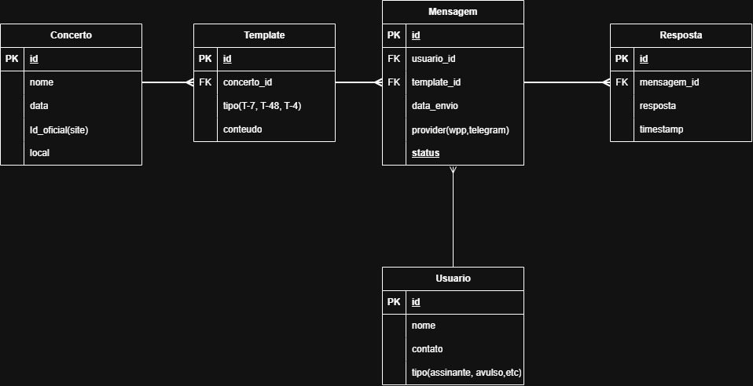

## Diagrama Relacional do Banco de Dados

Abaixo está o diagrama relacional do banco de dados utilizado pela aplicação, mostrando as entidades principais e seus relacionamentos.




## Seed do banco de dados para teste

Após iniciar o servidor, podes popular a base de dados com os concertos da temporada e os seus respectivos templates de notificação utilizando os comandos `curl` abaixo.

### 1. Criar Concertos

```bash
# Concerto 1: Ensaio Aberto
curl -X 'POST' 'http://localhost:8000/concert/' -H 'Content-Type: application/json' -d '{
  "id_site": 202601,
  "nome": "Ensaio aberto: Pierre Laurent-Aimard visita Haydn e Messiaen",
  "data": "2026-05-14",
  "horario": "10:00",
  "local": "Sala São Paulo",
  "link": "https://osesp.art.br/ensaio-aberto"
}'

# Concerto 2: Brahms
curl -X 'POST' 'http://localhost:8000/concert/' -H 'Content-Type: application/json' -d '{
  "id_site": 202602,
  "nome": "Osesp duas e trinta: um réquiem alemão de Brahms",
  "data": "2026-05-22",
  "horario": "14:30",
  "local": "Sala São Paulo",
  "link": "https://osesp.art.br/brahms-230"
}'

# Concerto 3: Mahler
curl -X 'POST' 'http://localhost:8000/concert/' -H 'Content-Type: application/json' -d '{
  "id_site": 202603,
  "nome": "Semana do Meio Ambiente | Câmara: canções da Terra e da alma de Mahler",
  "data": "2026-05-31",
  "horario": "19:00",
  "local": "Estação Motiva Cultural",
  "link": "https://osesp.art.br/mahler-meio-ambiente"
}'

```

### 2. Criar Templates de Mensagens

#### Concerto 1 (ID 1)

```bash
curl -X 'POST' 'http://localhost:8000/template/' -H 'Content-Type: application/json' -d '{"concerto_id": 1, "tipo": "T-7", "conteudo": "Olá! Falta 1 semana para o Ensaio Aberto com Pierre Laurent-Aimard. Nos vemos na Sala São Paulo!"}'
curl -X 'POST' 'http://localhost:8000/template/' -H 'Content-Type: application/json' -d '{"concerto_id": 1, "tipo": "T-48", "conteudo": "Faltam 48h! Prepare-se para visitar Haydn e Messiaen com a OSESP no ensaio aberto."}'
curl -X 'POST' 'http://localhost:8000/template/' -H 'Content-Type: application/json' -d '{"concerto_id": 1, "tipo": "T-4", "conteudo": "É hoje! O ensaio aberto começa em 4 horas. Já está a caminho da Sala São Paulo?"}'

```

#### Concerto 2 (ID 2)

```bash
curl -X 'POST' 'http://localhost:8000/template/' -H 'Content-Type: application/json' -d '{"concerto_id": 2, "tipo": "T-7", "conteudo": "Em 7 dias, o Réquiem Alemão de Brahms na Sala São Paulo. Uma obra profunda que aguarda você."}'
curl -X 'POST' 'http://localhost:8000/template/' -H 'Content-Type: application/json' -d '{"concerto_id": 2, "tipo": "T-48", "conteudo": "Faltam 48h para Brahms. Verifique seu ingresso para o concerto Osesp duas e trinta."}'
curl -X 'POST' 'http://localhost:8000/template/' -H 'Content-Type: application/json' -d '{"concerto_id": 2, "tipo": "T-4", "conteudo": "O Réquiem de Brahms começa em 4 horas! Esperamos você na Sala São Paulo."}'

```

#### Concerto 3 (ID 3)

```bash
curl -X 'POST' 'http://localhost:8000/template/' -H 'Content-Type: application/json' -d '{"concerto_id": 3, "tipo": "T-7", "conteudo": "Semana do Meio Ambiente: em 7 dias, Mahler na Estação Motiva Cultural."}'
curl -X 'POST' 'http://localhost:8000/template/' -H 'Content-Type: application/json' -d '{"concerto_id": 3, "tipo": "T-48", "conteudo": "Faltam 48h! Canções da Terra e da Alma esperam por você na Estação Motiva Cultural."}'
curl -X 'POST' 'http://localhost:8000/template/' -H 'Content-Type: application/json' -d '{"concerto_id": 3, "tipo": "T-4", "conteudo": "Começamos em 4 horas! Mahler e a Semana do Meio Ambiente na Estação Motiva Cultural."}'

```